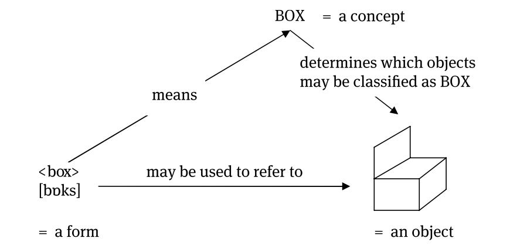

# Chapter 1

## Introduction
Speaking is an everyday process that we often perform without conscious thought. This automaticity is beneficial; if we had to deliberate over each sound in every word we utter, it would take hours to complete a single sentence. Similar to walking, speaking relies on efficient routines that, once learned, become automatic.
This automaticity works well with our native language but poses challenges when learning a new, foreign language. Foreign languages not only have different words but often include unfamiliar sounds. For instance, German learners of English struggle with the "lisping" sound in words like "bath," "therapy," and "mathematics" because this sound does not exist in German. Conversely, English learners of German find it difficult to pronounce the vowel in "Müsli" (‘muesli’) and "Hüte" (‘hats’), as this sound is not part of the English sound inventory. This highlights that languages use only a subset of possible speech sounds and each language has its unique set of sounds. Therefore, foreign language learners must learn new muscle movements to produce these unfamiliar sounds.
Phonetics, a subdiscipline of linguistics, addresses the characteristics of speech sounds. It seeks to answer questions about the types of speech sounds in different languages, how to describe these sounds, and the criteria for distinguishing them. Phonetics has several branches: articulatory phonetics focuses on how speech sounds are produced and the differences in articulation; acoustic phonetics examines the physical properties of speech sounds and how to measure these differences; and auditory phonetics explores how speech sounds are perceived and processed by listeners. This chapter primarily deals with articulatory phonetics.
The chapter proceeds with an introduction to notational conventions used in phonetics, an overview of the nature and production of speech sounds, and a detailed discussion on describing and classifying sounds, particularly in English. The chapter concludes with a summary of the findings.

# Phonetics
## Summary 
The first chapter discusses the intricacies of speech production and pronunciation, particularly in the context of learning new languages. It highlights that while speaking is mostly automatic in one's native language, learning a foreign language requires conscious effort due to unfamiliar sounds and articulations. For instance, German learners of English struggle with sounds like "lisping" in words such as "bath" and "therapy" due to the absence of such sounds in German. Similarly, English learners of German face difficulties with unfamiliar vowels.

# Chapter 5: Semantics

## Semantics: Exploring the Complexity of Meaning in Language

[Semantics](https://en.wikipedia.org/wiki/Semantics) is the branch of linguistics dedicated to studying how words and sentences convey meaning. Although it may seem straightforward, semantics involves complex relationships between words, their [referents](https://www.vocabulary.com/dictionary/referent), and the [mental processes](https://www.vocabulary.com/dictionary/mental%20process) that underpin understanding. One key aspect of semantics is the [arbitrary](https://www.vocabulary.com/dictionary/arbitrary) nature of words. There is no inherent connection between a word's sound or structure and its meaning. 
For example, consider these words:
a. English: box [bɒks] 
b. German: Kiste  [kɪstə]
c. Spanish: caja [kaxa]
d. Mandarin Chinese:  xiá [çia]
They demonstrate that different languages use unique sequences of sounds to represent the same object. While dictionary definitions provide a basic description, they do not fully capture the richness of meaning. Context plays a crucial role in semantics. A word like _box_ can refer to a variety of objects depending on the context and usage. Similarly, terms like _container_ and _thingy_ can refer to box-like objects, but they carry different connotations and are used in different situations. This highlights the limitations of viewing semantics as a simple one-to-one mapping between words and objects. 

The complexity of semantics is further illustrated by the role of concepts—abstract mental categories that help us classify and interpret words. Concepts are [cognitive](https://www.vocabulary.com/dictionary/cognitive) constructs that exist independently of language, but they shape our understanding of linguistic expressions. For example, while a cardboard box and a shopping cart could both be considered _containers_, their suitability for the term _box_ varies based on conceptual categorization.

## Concepts and Their Properties

Concepts play a pivotal role in semantics.

Concepts are **mental categories** that help us classify and categorize objects. A dictionary definition, like the one for _box,_ outlines specific properties that describe a concept's essential characteristics, such as _a container for putting things in, especially one with four stiff sides_. However, concepts often have fuzzy boundaries, allowing for some flexibility in classification. While some objects clearly fit the definition of a "box," others, like a shopping cart, might be described as _some kind of box, but..._. This ambiguity highlights that concepts are not always rigid and can straddle boundaries.

## 5.3 Compositional Meaning: Building from Parts

**Chapter 5.3** discusses the [phenomenon](https://en.wikipedia.org/wiki/Phenomenon) of **compositional** and **non-compositional** meaning. Compositional meaning arises when the meaning of a linguistic unit is derived from the meanings of its individual components and the way they are combined. This can be seen in sentences and phrases where each word contributes to the overall meaning.
For example, in the sentence _We would like to apologize for any inconvenience caused_ the meaning can be broken down into parts, with each word or phrase adding to the overall interpretation. The meaning of "we" identifies the subject, "would like" indicates a desire, and "apologize for any inconvenience caused" expresses regret for causing inconvenience. This structure exemplifies compositional meaning, where the whole is the sum of its parts.

## Non-Compositional Meaning: Idioms and Ambiguity
**Non-compositional** meaning occurs when the meaning of a linguistic unit cannot be directly derived from its individual parts. Idiomatic expressions, like _kick the bucket_ mean something entirely different from the literal interpretation of their words. Similarly, [compounds](https://en.wikipedia.org/wiki/Compound_(linguistics)) such as _dog house_ can be ambiguous, suggesting a house for dogs, a house shaped like a dog, or other interpretations. This ambiguity highlights that not all meanings are compositional. In addition to compositionality, the concept of [semantic scope](https://en.wikipedia.org/wiki/Scope_(formal_semantics)) plays a role in meaning. This refers to how the meaning of a morpheme can extend beyond the base to which it is formally attached. For example, in the phrase _the blue boxes looked terrific_ the plural suffix in _boxes_ applies to the entire noun phrase, not just the word _box_. Similarly, the past tense suffix in _looked_ can extend to the entire verb phrase _look terrific_. This concept of scope is critical in understanding how meaning operates at different levels of linguistic structure. While semantic meaning focuses on the meaning derived from linguistic elements, pragmatic meaning considers the communicative purpose of a sentence. This relies on context, cultural knowledge, and situational factors. 

## Words and other words

In **chapter 5.4.1**, the focus is on the organization of word meaning in the mental lexicon. The [mental lexicon](https://en.wikipedia.org/wiki/Mental_lexicon), similar to a comprehensive dictionary, stores words known as _[lexemes](https://en.wikipedia.org/wiki/Lexeme)_ and facilitates their use in language production and comprehension. The chapter explores the role of word relations in defining meaning. It emphasizes that words are interconnected in a network-like structure within the mental lexicon, and these connections play a crucial role in determining word meaning. Additionally, the chapter explores the properties of sense relations and connotations, highlighting how these influence the network of word meanings. In general, **chapter 5.4.1** provides insight into the organization of word meanings within the mental lexicon, emphasizing the interconnectedness of words and the role of word relations in shaping meaning.

## Same or different?

**Chapter 5.4.2** discusses the semantic relations between words within the [mental lexicon](https://en.wikipedia.org/wiki/Mental_lexicon). It explores how words are interconnected through various semantic relationships such as [hyponymy](https://en.wikipedia.org/wiki/Hypernymy_and_hyponymy) and oppositeness, attempting to explain how these sense relations differ from connotation and contribute to the organization of word meanings. The chapter highlights the crucial role that _semantic relations_ play in linking words within the mental lexicon, emphasizing how these connections create a structured network of word meanings. By examining how semantic relations shape the relationships between different words, the chapter provides insights into the web of connections that exist within the mental lexicon, highlighting the significance of these semantic relationships in organizing and defining word meanings.

Here's an example of the relationship between hyponyms and hypernym from [Wikipedia](https://en.wikipedia.org/wiki/Hypernymy_and_hyponymy):

Here's a selected few examples of hypernyms and hyponyms:
| Hypernym | Hyponym | Example |
|---|---|---|
| Furniture | Chair, table, sofa | A chair is a type of furniture |
| Vehicle | Car, truck, bicycle | A car is a type of vehicle |
| Clothing | Shirt, pants, dress | A shirt is a type of clothing |

## Conclusion

**Chapter 5.5** focuses on the discipline of [semantics](https://en.wikipedia.org/wiki/Semantics), which is concerned with the meaning of linguistic expressions. It highlights that meaning is a relational property that describes the connection between the form of a linguistic expression and a mental concept, distinct from the relation linking linguistic expressions and the objects, events, or situations they refer to. The chapter discusses the different levels at which meaning arises, distinguishing between compositional and non-compositional types of meaning based on whether the meaning involves the combination of parts of the expression. It delves into how meaning is organized in the mental lexicon, likening it to a vast network where lexemes are interconnected through various semantic links, such as:

* Sense relations (like hyponymy and oppositeness),
* Connotation

By exploring the organization of word meanings in the mental lexicon, the chapter underscores the network of semantic relationships that shape our understanding of language and how words are interconnected based on their meanings.
